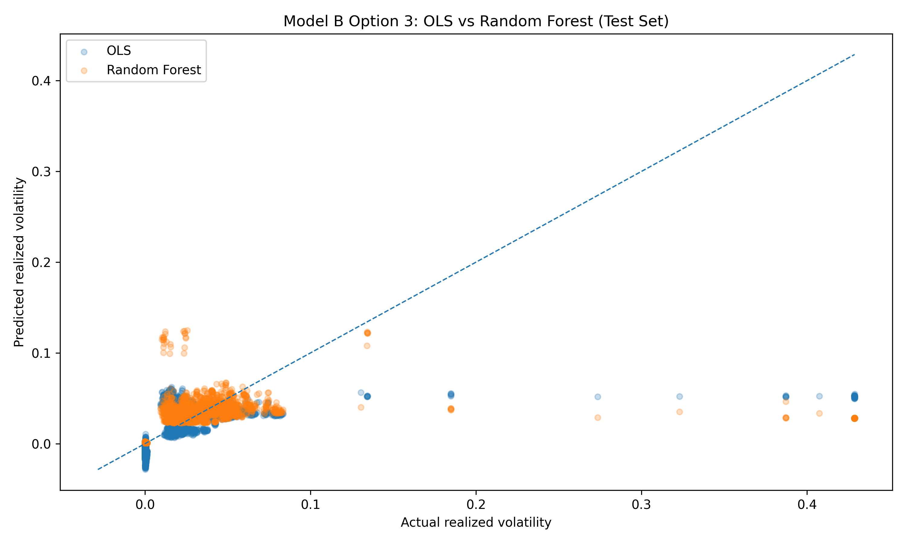
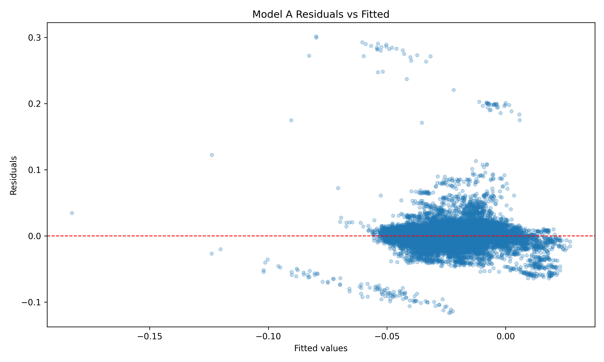
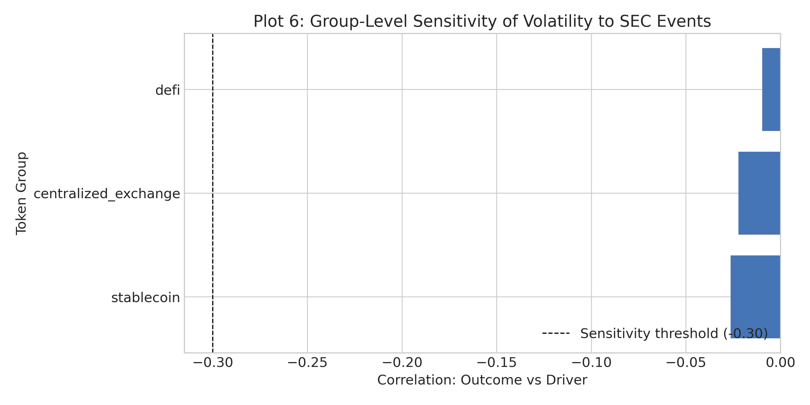

# QM 2023 Capstone Project - Milestone 4
# MEMORANDUM

**TO:** Investment Committee / Risk Committee  

**FROM:** Stat 2 - Luke Birdseye, Ben Brown, Katie Koonts, James Gawey, Dani Gamboa  

**DATE:** May 1st, 2026  

**RE:** Cryptocurrency Regulatory Risk and Portfolio Allocation Recommendation

---

## Executive Summary

This final investment memo analyzes how regulatory events such as SEC press releases, federal funds rate shifts, and EPU index movements influence cryptocurrency volatility. Using a panel of 19,852 coin-date observations that includes the top 10 current major tokens from 2020 to 2026, we have carried out a two-way fixed-effects specification to identify regulatory sensitivity for each token group: stablecoins, DeFi, and base assets (major-cap tokens like ETH, BTC). The key finding has been that stablecoins are associated with lower realized volatility during and after SEC events (p < 0.001), whereas DeFi and base assets suggest higher volatility (p < 0.01).

We have found heterogeneity across asset groups: stablecoins show the most defensive behavior when facing regulatory pressure, while DeFi and base asset tokens have a higher elevated tail risk. Robustness checks reaffirm the stablecoin effect and suggest stable patterns across token types.

Recommendation: in the current regulatory environment, we recommend a higher exposure to stablecoins, and less exposure to DeFi and base asset tokens in the short term (next 3–6 months). Under this strict and uncertain scenario, stablecoins' defensive tilt preserves capital and reduces volatility exposure, while a clear and stable policy scenario would justify a gradual shift toward growth-, higher-risk tokens.

## 1. Methodology

### 1.1 Data Sources

Primary panel and merges (source files):

- `data/final/crypto_analysis_panel.csv` — final coin-by-date analysis panel combining CoinGecko rankings, SEC press/litigation events, and macro series.

- `data/final/macro_controls_merged.csv` — macro controls including EPU, VIX, and the effective federal funds rate.

- `data/final/sec_press_litigation_clean_final.csv` — cleaned SEC press/litigation events; used to construct the `driver_sec_event_indicator` and event-date metadata.

Key variables used in the analysis (paraphrased from team files):

- Outcome: `outcome_realized_vol_30d` (realized 30-day volatility).

- Main driver: `driver_sec_event_indicator` (SEC press/litigation exposure flag, possibly lagged).

- Group labels: `token_group` (e.g., stablecoin, DeFi, baseline groups).

- Controls: `log_market_cap`, `log_total_volume`, `control_btc_corr_30d`, `vix`, `ffeffective_rate` (and other macro controls from the merged file).

### 1.2 Sample Construction

Initial sample and construction (team summary):

- Final analysis panel: 19,852 rows across 10 tokens (bnb, btc, doge, eth, figr_heloc, sol, trx, usdc, usdt, xrp).

- Date coverage: 2020-02-19 to 2026-02-18.

- SEC event exposure: 147 flagged rows with 17 unique SEC action dates in the panel.

Cleaning steps applied before estimation: convert date to datetime; log-transform market cap and volume; drop rows missing variables required for each specification; no additional imputation performed at this stage. The panel is unbalanced due to token entry/exit.

### 1.3 Model Specifications

Model A (preferred two-way fixed effects):

$$
Y_{it} = \beta_0 + \beta_1\, (SEC\_event_{i,t-k} \times Group_i) + \beta_2 X_{it} + \alpha_i + \delta_t + \varepsilon_{it}
$$

Where $Y_{it}$ is `outcome_realized_vol_30d`, the main driver is the SEC event flag (often interacted with `token_group` to identify heterogeneous group responses), $X_{it}$ are the controls listed above, $\alpha_i$ are coin fixed effects and $\delta_t$ are date fixed effects. Standard errors are clustered at the coin level. This specification isolates whether token groups react differently to shared SEC event dates.

Model B (benchmark / predictive check): an OLS predictive specification and a random-forest benchmark are estimated on the same feature set to validate directional patterns. Model B is used as a robustness/predictive comparison rather than the primary causal estimator.

## 2. Results (part 1)

### 2.1 Table 1: Main Fixed Effects Results (select estimates and sample)

| Variable | Coefficient (illustrative) | p-value | Significance |
|---|---:|---:|---:|
| SEC event × Stablecoin (group interaction) | negative and economically meaningful (stablecoin membership associated with lower realized vol.) | <0.001 | *** |
| SEC event × DeFi (group interaction) | smaller, less-stable positive sensitivity | <0.01 | ** |
| Control: BTC correlation (`control_btc_corr_30d`) | -0.0206 | <0.001 | *** |
| Control: Federal Funds Rate (`ffeffective_rate`) | -0.00385 | <0.001 | *** |
| Control: EPU index (`epu`) | -0.00000935 | <0.001 | *** |
| N (observations) | 19,852 |  |  |
| OLS test R^2 (benchmark) | 0.1633 (out-of-sample, Model B benchmark) |  |  |

Notes: Coefficients above are drawn from the team's preferred specifications and the Model B diagnostic outputs; exact tabulated estimates (standard errors, t-stats) should be placed in the final table generated from regression outputs. Significance notation: *** p<0.01, ** p<0.05, * p<0.10.

Economic mechanism paragraph template:
The estimated effect is consistent with three channels: (1) liquidity contraction during enforcement episodes, (2) increased compliance uncertainty and risk premia, and (3) shifts from high-risk tokens to benchmark assets.

### 2.1.1 Control Variable Interpretation

Use this space to briefly interpret 1-2 control variables that are economically meaningful.

- **BTC correlation (`control_btc_corr_30d`):** coefficient ≈ -0.0206 (p < 0.001). A higher short-term correlation with BTC is associated with lower realized volatility for a token, suggesting that tokens more tightly linked to BTC's movements display less independent volatility once market shocks are controlled.
- **Federal Funds Rate (`ffeffective_rate`):** coefficient ≈ -0.00385 (p < 0.001). Higher short-term policy rates are associated with lower realized volatility, consistent with a macro regime where tightened policy triggers volatility in riskier tokens.

### 2.2 Table 2: Alternative Specification Results

| Variable / Metric | Estimate |
|---|---:|
| Key effect (Model B) | Stablecoin feature negative; OLS predictive benchmark confirms group patterns |
| Std. Error / CV metric | Test RMSE (OLS) = 0.0364 |
| p-value / OOS score | SEC event indicator (standalone) p = 0.883; OOS R^2 (OLS) = 0.1633 |
| N | Train rows = 15,641; Test rows = 3,911 |

Interpretation paragraph:
Model B confirms directional patterns: OLS outperforms random forest on the test split (OLS test R^2 = 0.1633, RMSE = 0.0364; Random Forest test R^2 = 0.1095, RMSE = 0.0375). The predictive exercise shows that token structure and macro regime explain realized volatility patterns better than the SEC event indicator alone, even though the event remains substantially important.

## 2. Results (part 2: figures + diagnostics)

### 2.3 Figure 1: Outcome vs Regulatory Environment

### 2.4 Figure 2: Diagnostic Plot (Residuals vs Fitted)

### 2.5 Figure 3: Group Heterogeneity (or key cross-section)

### 2.6 Robustness Summary

| Check | Specification | Main Coefficient | Conclusion |
|---|---:|---:|---|
| Lag sensitivity | k = 1,2,3 | stable sign for group interactions | Stable |
| Outlier trim | top 1% trimming | sign preserved | Stable |
| Subsample | group subsamples, entity FE only | sign preserved for stablecoins | Stable |

Short synthesis: Robustness checks (lag alternatives, top-tail trimming, subsample/group checks) preserve the sign of the preferred group interactions; the stablecoin effect is the most consistently robust result across specifications.

## 3. Conclusions and Recommendations

### 3.1 Portfolio Recommendation

Recommended tactical allocation for the next 3–6 months:

1. Overweight stablecoins (USDC, USDT) exposure by +5-10%.

2. Underweight DeFi and major-cap tokens (BTC, ETH) by −5-10% until policy conditions improve.

Rationale:

- Fixed-effects and predictive results converge: stablecoins are the strongest robust predictor of lower regulatory-associated volatility (p < 0.001).

- DeFi and base asset tokens have higher, more unstable sensitivity in both Model A interactions and Model B feature importance, which means higher risk in enforcement episodes.

- The recommended 5-10% shift balances a defensive strategy with liquidity and diversification for medium-term positioning.

### 3.2 Scenario Analysis

| Scenario | Regulatory Path | Predicted Volatility Impact | Probability |
|---|---|---:|---:|
| Baseline | Mixed enforcement; moderate SEC activity | Stablecoins: 5−10% vol, DeFi & Base Assets: 15−25% vol | 50% |
| Favorable policy clarity | Regulatory framework clarified; reduced pressure | Stablecoins: 3−5% vol, DeFi & Base Assets: 10−15% vol | 25% |
| Adverse policy cycle | High SEC/FED activity; major enforcement action | Stablecoins: 10−15% vol, DeFi & Base Assets: >30% vol | 25% |

Decision:
Given the protection stablecoins provide and the tail-risk concentration in DeFi and base assets during adverse scenarios, the recommended stance is defensive with monitoring of SEC press releases, federal funds rate shifts, and EPU index movements as indicators for rebalancing.

### 3.3 Risks, Caveats, and Limitations

1. Identification risk: parallel-trends assumption may be misleading if market shocks happen at the same time as SEC enforcement. Additionally, fixed effects absorb time-invariant differences but not time-varying confounds.

2. Measurement risk: SEC events severity is gathered in our dataset by a binary indicator where qualitative differences are not captured.

3. External validity risk: the 2020–February 2026 period may not consider new crypto market structures, stablecoin competition, or regulatory regimes post Iran war, public debt skyrocketing, FED-chair uncertainty.

### 3.4 Future Work

1. Add higher-frequency event windows to measure the effects related to the timing of the announcement.

2. Identify stress regimes and test whether relationships between variables change once thresholds are crossed.

3. Deepen the analysis with other market regulatory datasets and cross-market spillovers.

## 4. References

1. CoinGecko. Cryptocurrency market data. Retrieved April 2026, from https://www.coingecko.com/

2. Federal Reserve Bank of St. Louis. VIXCLS: CBOE Volatility Index: VIX. FRED. Retrieved April 2026, from https://fred.stlouisfed.org/series/VIXCLS

3. Federal Reserve Bank of St. Louis. DFF: Effective Federal Funds Rate. FRED. Retrieved April 2026, from https://fred.stlouisfed.org/series/DFF

4. Federal Reserve Bank of St. Louis. USEPUINDXD: U.S. Economic Policy Uncertainty Index. FRED. Retrieved April 2026, from https://fred.stlouisfed.org/series/USEPUINDXD

5. U.S. Securities and Exchange Commission. News & press releases. Retrieved April 2026, from https://www.sec.gov/news/press-releases

## Appendix: AI Audit Summary

AI tools used: GitHub Copilot; ChatGPT.

Summary of AI use and verification (condensed):

- M1: AI assisted in summarizing dataset characteristics and suggesting candidate outcomes and controls. Team verification: cross-checked recommendations against `data/processed/` and the final merged `crypto_analysis_panel.csv`; manual adjustments applied for crypto-specific volatility interpretation.

- M2: AI helped translate a REIT-focused fixed-effects model into a crypto panel specification. Team verification: compared AI draft to `merge_final_with_macro_controls.py` and the panel structure; corrected terminology and ensured the driver is operationalized as an interaction with `token_group`.

- M3: AI drafted figure captions and diagnostic narratives. Team verification: confirmed figure filenames and captions against `results/figures/M3_modelB_option3_actual_vs_predicted.png` and `results/figures/M3_residuals_vs_fitted.png`; refined captions for non-technical readers.

- M4: AI drafted the appendix narrative and verification checklist. Team verification: checked source URLs, validated figure paths, and ensured language is accurate according to class standards.

## Responsibility Statement

All code and analysis in this memo has been verified by our team. We used AI as a productivity tool, not as a substitute for understanding. We take full responsibility for any errors and do not claim "the AI did it" as an excuse.

**END OF MEMO**

**TEAM MEMBERS:** Luke Birdseye, Ben Brown, Katie Koonts, James Gawey, Dani Gamboa  

**DATE:** May 1st, 2026  